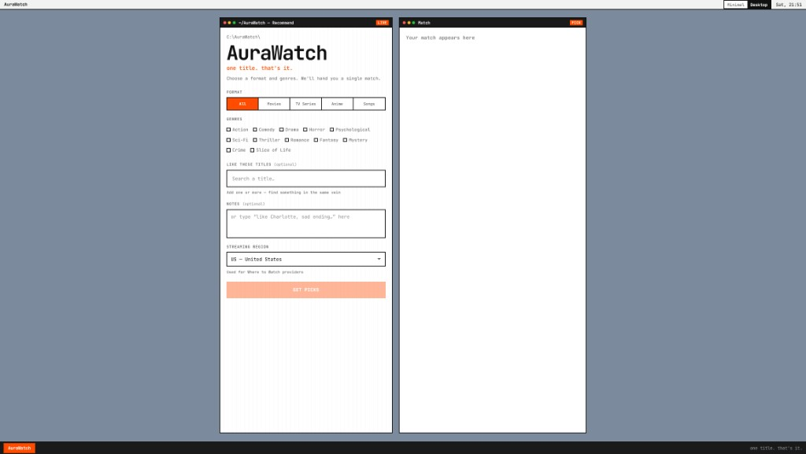
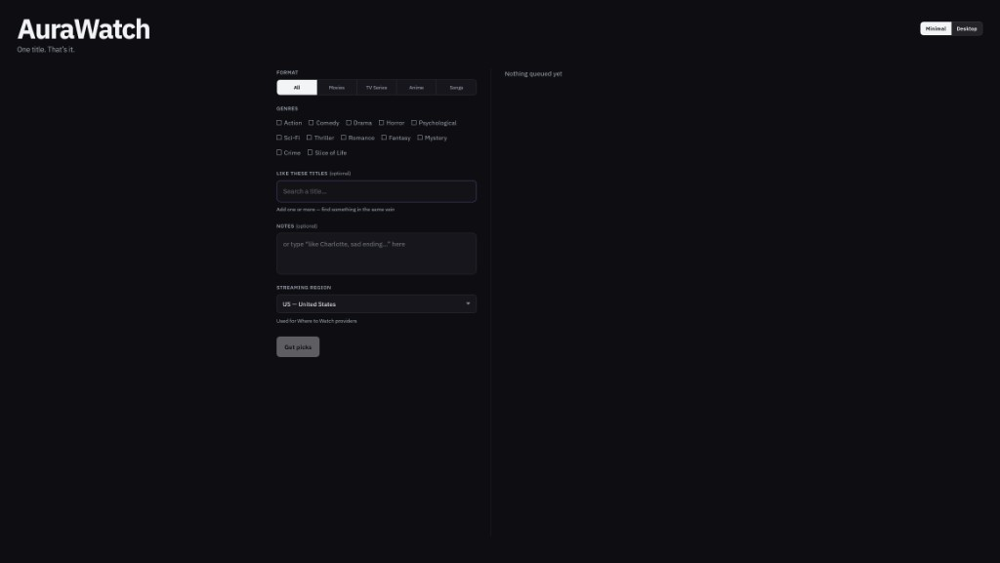
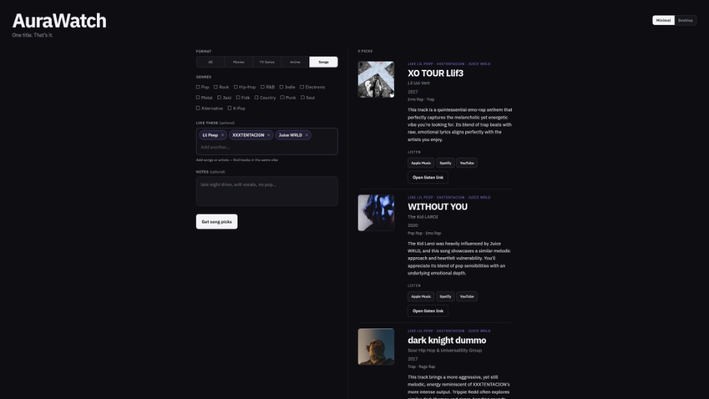

# AuraWatch

A vibe finder for movies, TV, anime, and songs — tell it what you’re in the mood for, get a handful of titles that actually fit.



**[Try the demo →](https://aura-watching.vercel.app/)**

<p align="center">
  
  
</p>

---

## Quick start

If it’s deployed, open the link above. That’s it.

To run it yourself:

```bash
npm install
cp .env.example .env
npm run dev
```

Open [http://localhost:5173](http://localhost:5173). Needs **Node 20+**.

### Environment

Put these in `.env` (see `.env.example`):

| Variable | What it’s for |
|---|---|
| `GEMINI_API_KEYS` | Comma-separated Gemini keys. The app rotates through them when one fails. |
| `TMDB_API_KEY` | Posters, similar-title search, and “where to watch” providers. |
| `TMDB_WATCH_REGION` | Fallback region only — users pick their own in the UI. |

No keys? It still runs off a small local catalog. Recommendations get smarter once Gemini + TMDB are set. Song mode needs Gemini.

---

## Features

- Pick a format (movies, series, anime, songs, or all) and multi-select genres
- Free-text vibe prompt *and/or* “similar to…” titles with live search
- Region-aware streaming provider logos (from TMDB / JustWatch data)
- Dual UI themes — dark minimal or light desktop board — remembered in localStorage
- Listen links for songs (Apple Music / Spotify-style search) via iTunes
- Falls back to a curated catalog when external APIs flake

---

## How it works

Recommendations don’t all go through one path. The backend picks the least-fake option for what you asked:

1. **Songs** → Gemini suggests tracks → iTunes fills covers and listen URLs  
2. **“Like this title”** → TMDB similar / recommendations, filtered by your genres  
3. **Vibe / genres** → Gemini concierge (strict JSON) → TMDB for posters + providers  
4. **Anything fails** → score a local catalog by format, genres, and vibe keywords  

Gemini is great at *taste* and terrible at *valid JSON*, so there’s a repair pass for fences, curly quotes, and trailing commas. Keys rotate with a short cooldown when one burns out. Genres on a result are the title’s real tags — never a copy of whatever you clicked in the UI.

Stack: SvelteKit 2 + Svelte 5, Tailwind 4, Gemini Flash, TMDB, iTunes Search.

---

## Scripts

```bash
npm run dev      # local server
npm run build    # production build
npm run preview  # preview the build
npm run check    # svelte-check / types
```

---

## Credits

- [The Movie Database (TMDB)](https://www.themoviedb.org/) for search, similar titles, posters, and watch providers  
- [Google Gemini](https://ai.google.dev/) for the concierge prompts  
- [Apple iTunes Search API](https://affiliate.itunes.apple.com/resources/documentation/itunes-store-web-service-search-api/) for music lookup  
- [SvelteKit](https://svelte.dev/docs/kit) + [Tailwind CSS](https://tailwindcss.com/)

**AI usage:** under 19%.
